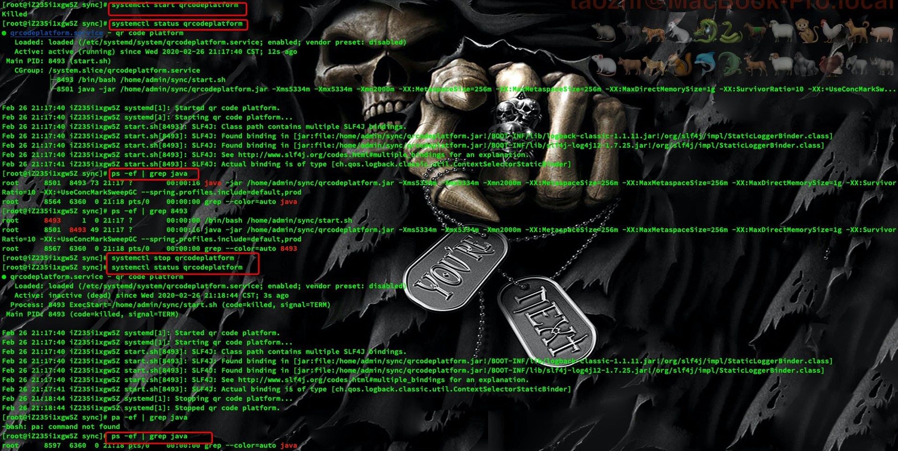
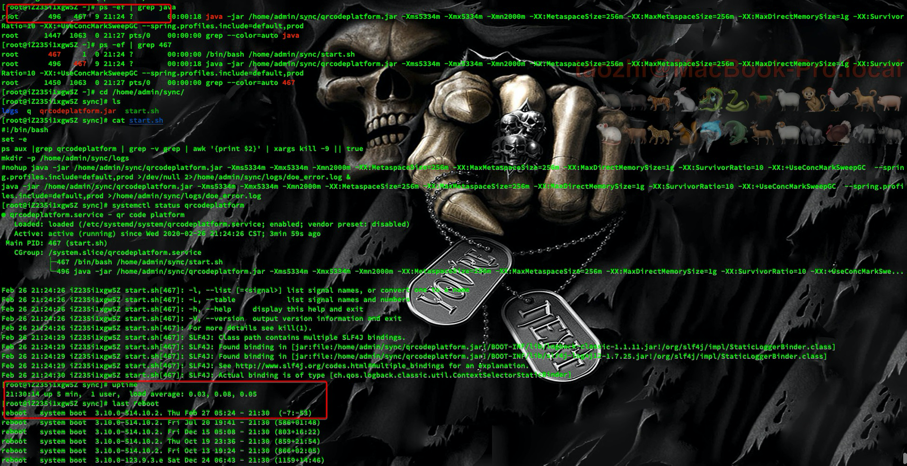
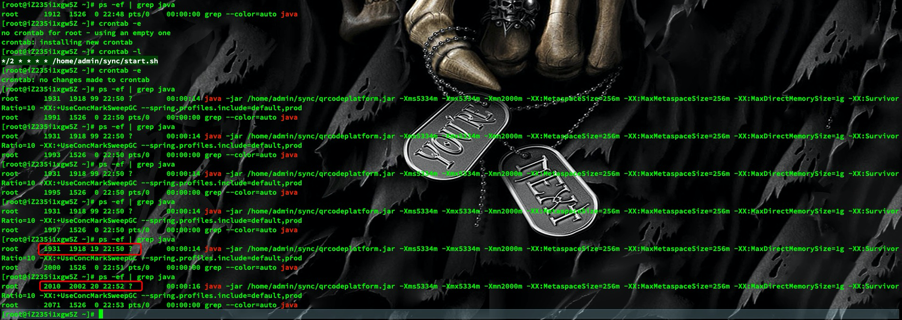

# Systemd


## Authorize shell script

要执行的脚本内容，请自行定义

```bash
#!/bin/bash
set -e
ps aux | grep qrcodeplatform | grep -v grep | awk '{print $2}' | xargs kill -9 || true
mkdir -p /home/admin/sync/logs
java -jar /home/admin/sync/qrcodeplatform.jar -Xms5334m -Xmx5334m -Xmn2000m -XX:MetaspaceSize=256m -XX:MaxMetaspaceSize=256m -XX:MaxDirectMemorySize=1g -XX:SurvivorRatio=10 -XX:+UseConcMarkSweepGC  --spring.profiles.include=default,prod > /home/admin/sync/logs/doe_error.log
```

给脚本执行权限

- `chmod 755 /home/admin/sync/start.sh`

## Create service

- `vim /etc/systemd/system/qrcodeplatform.service`

```bash
[Unit]
Description = qr code platform
After = network.target

[Service]
ExecStart = /home/admin/sync/start.sh
Restart = on-abort

[Install]
WantedBy = multi-user.target
```

- `chmod 664 /etc/systemd/system/qrcodeplatform.service`

## Reload

- `sudo systemctl enable qrcodeplatform.service`
- `sudo systemctl daemon-reload`

## List
- `systemctl --type=service --all`

##  Start

- `systemctl start qrcodeplatform`

## Status

- `systemctl status qrcodeplatform`

## CMD



## Reboot System

- check whether the service start automatically or not



# Crontab

## Authorize shell script

- `chmod 755 /home/admin/sync/start.sh`

## Create

```bash
crontab -e
```

write the following content:

```bash
* */1 * * * /home/admin/sync/start.sh
```

it means "execute `/home/admin/sync/start.sh` every hour"

Linux Crontab Format
```
MIN HOUR DOM MON DOW CMD
```
Table: Crontab Fields and Allowed Ranges (Linux Crontab Syntax)
| Field | Description  | Allowed  Value |
| ----- | ------------ | -------------- |
| MIN   | Minute       | 0 to 59        |
| HOUR  | Hour field   | 0 to 23        |
| DOM   | Day of Month | 1-31           |
| MON   | Month field  | 1-12           |
| DOW   | Day Of Week  | 0-6            |
|   CMD    |     Command	        |         Any command to be executed.        |


Examples:

```
30 08 10 06 * /home/ramesh/full-backup
```
- 30 – 30th Minute
- 08 – 08 AM
- 10 – 10th Day
- 06 – 6th Month (June)
- \* – Every day of the week

```
00 11,16 * * * /home/ramesh/bin/incremental-backup
```
- 00 – 0th Minute (Top of the hour)
- 11,16 – 11 AM and 4 PM
- \* – Every day
- \* – Every month
- \* – Every day of the week

```
00 09-18 * * * /home/ramesh/bin/check-db-status
```

- 00 – 0th Minute (Top of the hour)
- 09-18 – 9 am, 10 am,11 am, 12 am, 1 pm, 2 pm, 3 pm, 4 pm, 5 pm, 6 pm
- \* – Every day
- \* – Every month
- \* – Every day of the week


The \* means all the possible unit — i.e every minute of every hour through out the year. More than using this * directly, you will find it very useful in the following cases.

- When you specify */5 in minute field means every 5 minutes.
- When you specify 0-10/2 in minute field mean every 2 minutes in the first 10 minute.

There are special cases in which instead of the above 5 fields you can use @ followed by a keyword — such as reboot, midnight, yearly, hourly.

Table: Cron special keywords and its meaning
| Keyword | Equivalent      |
| ------- | --------------- |
| @yearly | 0 0 1 1 *       |
| @monthly| 0 0 1 ** *   |
| @daily  | 0 0 * * *       |
| @hourly | 0 * * * *       |
| @reboot | Run at startup. |


## Check

```bash
crontab -l
```

to check the schedule

## Check the process

```
ps -ef | grep java
```

## Example

execute shell every two minutes



# References

- [How to Create and Run New Service Units in Systemd Using Shell Script](https://www.tecmint.com/create-new-service-units-in-systemd/)
- [Linux Crontab: 15 Awesome Cron Job Examples](https://www.thegeekstuff.com/2009/06/15-practical-crontab-examples/)